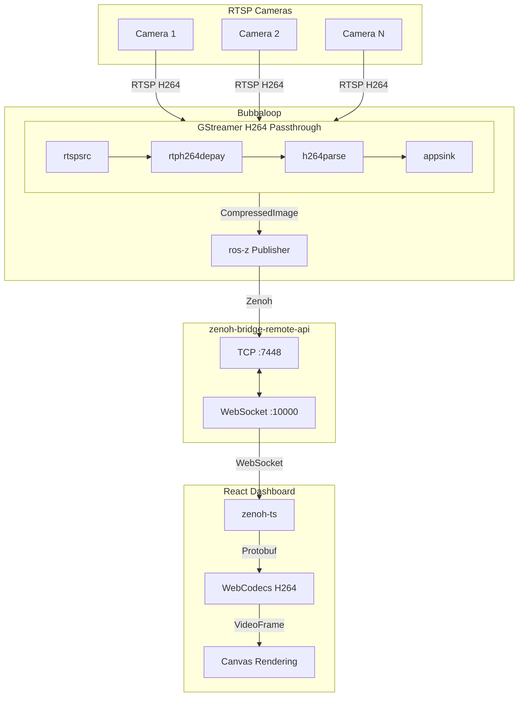
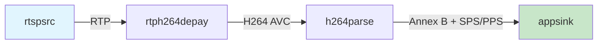

# Architecture

Bubbaloop is designed for efficient multi-camera streaming with minimal CPU overhead.

## System Overview



## Data Flow

```
RTSP Camera → GStreamer → ros-z → zenoh-bridge → WebSocket → Browser (WebCodecs)
```

1. **RTSP Camera**: Streams H264 video via RTSP protocol
2. **GStreamer**: Extracts H264 NAL units without decoding (zero CPU overhead)
3. **ros-z**: Publishes `CompressedImage` protobuf messages via Zenoh
4. **zenoh-bridge**: Bridges TCP Zenoh traffic to WebSocket for browsers
5. **Browser**: Decodes H264 using WebCodecs API (hardware accelerated)

## Components

### H264 Stream Capture

Located in `src/h264_capture.rs`, this component:

- Creates a GStreamer pipeline for each camera
- Receives H264 NAL units without decoding (zero CPU overhead)
- Injects SPS/PPS headers before each keyframe for stream compatibility
- Uses zero-copy buffer mapping for efficiency

**GStreamer Pipeline:**



### RTSP Camera Node

Located in `src/rtsp_camera_node.rs`, each camera node:

- Wraps the H264 capture in a ROS-Z node
- Publishes `CompressedImage` messages via Zenoh
- Includes header with timestamps and sequence numbers
- Handles graceful shutdown on Ctrl+C

### zenoh-bridge-remote-api

External component from [zenoh-ts](https://github.com/eclipse-zenoh/zenoh-ts):

- Bridges Zenoh TCP protocol to WebSocket
- Listens on TCP:7448 for Rust clients (cameras_node)
- Serves WebSocket on port 10000 for browser clients
- Enables browser-based Zenoh subscriptions

### React Dashboard

Located in `dashboard/`, the browser-based visualization:

- **zenoh-ts**: TypeScript Zenoh client for WebSocket subscriptions
- **Protobuf decoder**: Parses `CompressedImage` messages
- **WebCodecs**: Hardware-accelerated H264 decoding
- **Canvas rendering**: Displays decoded video frames
- **dnd-kit**: Drag-and-drop camera card reordering

## Message Format

### Protobuf Schema

```protobuf
message Header {
  uint64 acq_time = 1;   // Acquisition timestamp (nanoseconds)
  uint64 pub_time = 2;   // Publication timestamp (nanoseconds)
  uint32 sequence = 3;   // Frame sequence number
  string frame_id = 4;   // Camera name
}

message CompressedImage {
  Header header = 1;
  string format = 2;     // Always "h264"
  bytes data = 3;        // H264 NAL units (Annex B)
}
```

### Topic Naming

Each camera publishes to a ROS-Z topic:

```
/camera/{camera_name}/compressed
```

In Zenoh key expression format:

```
0/camera%{camera_name}%compressed/**
```

## Performance Characteristics

| Metric | Value |
|--------|-------|
| CPU overhead | Near zero (no decode) |
| Latency | ~200ms (configurable) |
| Memory per camera | ~10-50MB |
| Max cameras | Limited by network bandwidth |

## Browser Requirements

WebCodecs API is required for H264 decoding:

| Browser | Support |
|---------|---------|
| Chrome 94+ | ✅ |
| Edge 94+ | ✅ |
| Safari 16.4+ | ✅ |
| Firefox | ❌ |
