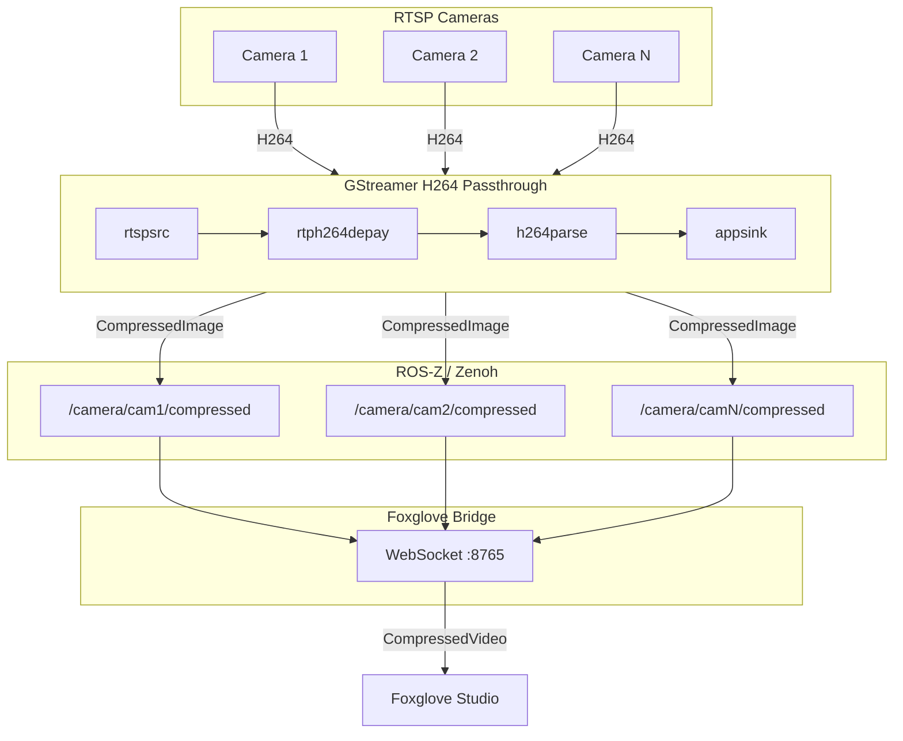
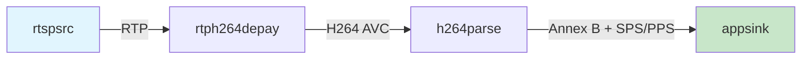

# Architecture

Bubbaloop is designed for efficient multi-camera streaming with minimal CPU overhead.

## System Overview



## Components

### H264 Stream Capture

Located in `src/h264_capture.rs`, this component:

- Creates a GStreamer pipeline for each camera
- Receives H264 NAL units without decoding (zero CPU overhead)
- Injects SPS/PPS headers before each keyframe for stream compatibility
- Uses zero-copy buffer mapping for efficiency

**GStreamer Pipeline:**



### RTSP Camera Node

Located in `src/rtsp_camera_node.rs`, each camera node:

- Wraps the H264 capture in a ROS-Z node
- Publishes `CompressedImage` messages via Zenoh
- Handles graceful shutdown on Ctrl+C

### Foxglove Bridge Node

Located in `src/foxglove_node.rs`, this component:

- Subscribes to all camera topics via ROS-Z
- Converts messages to Foxglove's `CompressedVideo` schema
- Serves a WebSocket server on port 8765
- Handles multiple concurrent Foxglove clients

## Message Format

### Protobuf Schema

```protobuf
message Header {
  uint64 acq_time = 1;   // Acquisition timestamp (nanoseconds)
  uint64 pub_time = 2;   // Publication timestamp (nanoseconds)
  uint32 sequence = 3;   // Frame sequence number
  string frame_id = 4;   // Camera name
}

message CompressedImage {
  Header header = 1;
  string format = 2;     // Always "h264"
  bytes data = 3;        // H264 NAL units (Annex B)
}
```