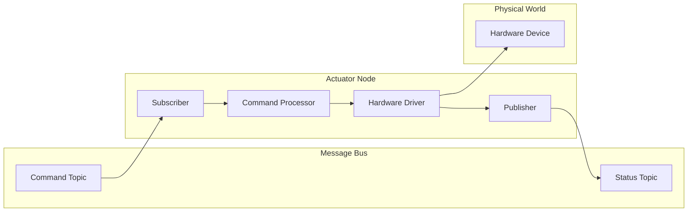
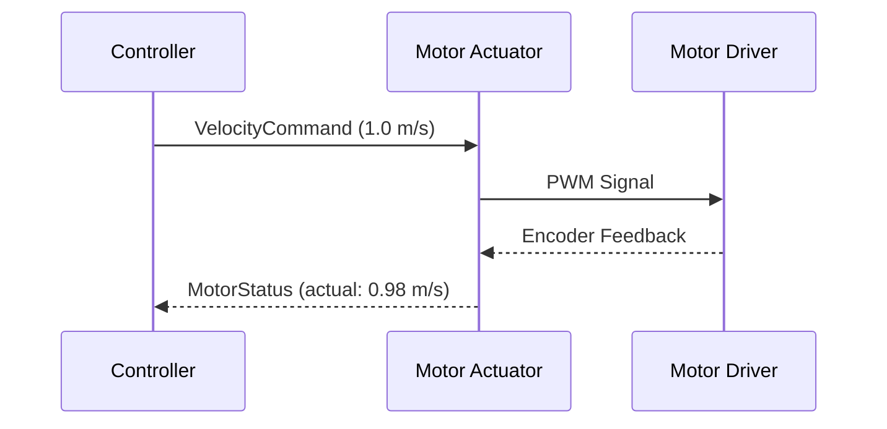

# Actuators

Actuators are components that interact with the physical world based on commands received via the Zenoh message bus.

## Status

Actuator components are planned for future development. This section documents the intended architecture and planned components.

## Planned Actuators

| Actuator | Description | Target |
|----------|-------------|--------|
| Motor Controller | DC motor, stepper motor control | TBD |
| Servo Controller | Position-controlled servos | TBD |
| Audio Output | Text-to-speech, alerts, audio playback | TBD |
| Display | LCD/LED display output | TBD |
| GPIO | General purpose I/O control | TBD |

## Actuator Architecture



## Common Patterns

### Command Interface

Actuators subscribe to command topics:

```
/actuator/{name}/command
```

### Status Feedback

Actuators publish status feedback:

```
/actuator/{name}/status
```

### Example Flow



## Planned Message Types

### Motor Commands

```protobuf
message VelocityCommand {
    Header header = 1;
    double linear_velocity = 2;   // m/s
    double angular_velocity = 3;  // rad/s
}

message MotorStatus {
    Header header = 1;
    double actual_velocity = 2;
    double motor_current = 3;
    double temperature = 4;
}
```

### Servo Commands

```protobuf
message ServoCommand {
    Header header = 1;
    repeated double positions = 2;  // Joint positions (rad)
}

message ServoStatus {
    Header header = 1;
    repeated double actual_positions = 2;
    repeated double velocities = 3;
    repeated double torques = 4;
}
```

## Hardware Considerations

### Real-time Requirements

Actuators often have real-time requirements:

| Requirement | Consideration |
|-------------|---------------|
| Latency | Minimize command-to-action delay |
| Jitter | Consistent timing for smooth motion |
| Safety | Emergency stop, watchdog timers |
| Feedback | Closed-loop control |

### Safety

Actuator implementations should include:

- Emergency stop functionality
- Watchdog timers for lost communication
- Position and velocity limits
- Current limiting
- Soft and hard stops

## Contributing

If you're interested in contributing actuator components:

1. Review the [Architecture](../../concepts/architecture.md)
2. Follow the component patterns in [Components Overview](../index.md)
3. Implement safety features
4. Add comprehensive tests
5. Submit a pull request

## Next Steps

- [Components Overview](../index.md) — Component architecture
- [Messaging](../../concepts/messaging.md) — Communication patterns
- [Architecture](../../concepts/architecture.md) — System design
