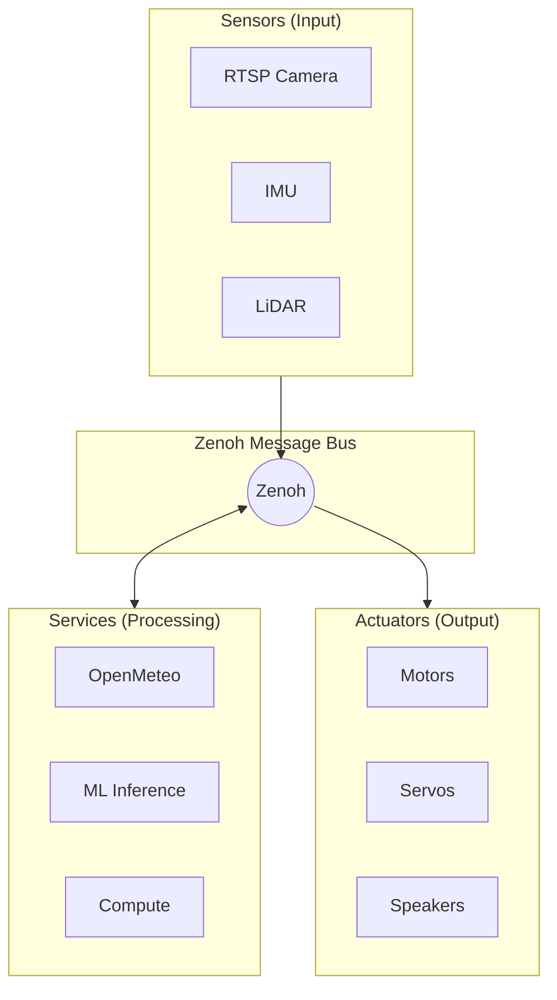
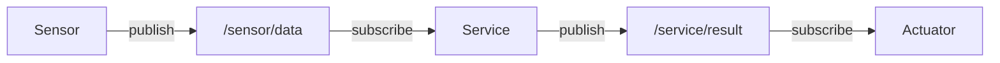

# Components

Bubbaloop components are the building blocks of physical AI systems. Each component is a specialized node (Bubble) that connects to the Zenoh message bus (Loop).

## Component Types



### Sensors

Sensors capture data from the physical world and publish it to the message bus.

| Component | Status | Description |
|-----------|--------|-------------|
| [RTSP Camera](sensors/rtsp-camera.md) | Available | Stream H264 video from RTSP cameras |
| IMU | Planned | Accelerometer, gyroscope, magnetometer |
| LiDAR | Planned | 3D point cloud capture |
| GPS | Planned | Location tracking |

[View all sensors →](sensors/index.md)

### Services

Services provide data processing, external integrations, or computed outputs.

| Component | Status | Description |
|-----------|--------|-------------|
| [OpenMeteo](services/openmeteo.md) | Available | Weather data from Open-Meteo API |
| ML Inference | Planned | Object detection, classification |
| SLAM | Planned | Simultaneous localization and mapping |

[View all services →](services/index.md)

### Actuators

Actuators interact with the physical world based on commands received via the message bus.

| Component | Status | Description |
|-----------|--------|-------------|
| Motor Controller | Planned | DC/stepper motor control |
| Servo Controller | Planned | Servo position control |
| Audio Output | Planned | Text-to-speech, alerts |

[View all actuators →](actuators/index.md)

## Component Structure

Each component follows a common pattern:

```
┌─────────────────────────────────────┐
│           Component Node            │
├─────────────────────────────────────┤
│  Configuration (YAML)               │
│  └─ Settings, parameters            │
├─────────────────────────────────────┤
│  Publishers                         │
│  └─ Output topics and messages      │
├─────────────────────────────────────┤
│  Subscribers (optional)             │
│  └─ Input topics for control        │
├─────────────────────────────────────┤
│  Processing Logic                   │
│  └─ Data capture, transformation    │
└─────────────────────────────────────┘
```

## Creating Components

Components are implemented as Rust applications using:

- **Zenoh**: Decentralized pub/sub with queryables
- **protobuf**: Message serialization
- **tokio**: Async runtime

### Basic Structure

```rust
// Example component structure
struct MyComponent {
    session: Arc<Session>,
    publisher: Publisher,
    config: ComponentConfig,
}

impl MyComponent {
    async fn new(config: ComponentConfig) -> Result<Self> {
        let session = zenoh::open(zenoh::Config::default()).await?;
        let publisher = session.declare_publisher("0/my_topic").await?;
        Ok(Self { session, publisher, config })
    }

    async fn run(&self) -> Result<()> {
        loop {
            let data = self.capture_data()?;
            let message = self.serialize(data)?;
            self.publisher.put(message).await?;
        }
    }
}
```

## Component Communication

All components communicate via Zenoh topics:



See [Messaging](../concepts/messaging.md) for protocol details.

## Next Steps

- [Sensors](sensors/index.md) — Available sensor components
- [Services](services/index.md) — Available service components
- [Actuators](actuators/index.md) — Planned actuator components
- [Topics](../concepts/topics.md) — Topic naming conventions
