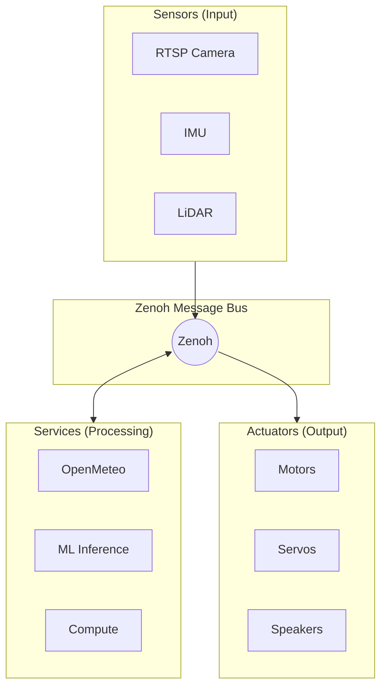
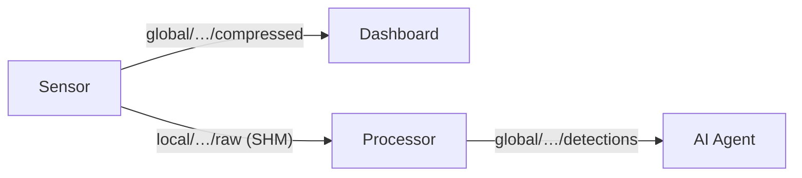

# Components

Bubbaloop components are the building blocks of physical AI systems. Each component is a specialized node (Bubble) that connects to the Zenoh message bus (Loop).

## Component Types


```mermaid
flowchart TB
    subgraph Sensors["Sensors (Input)"]
        direction LR
        cam[RTSP Camera]
        imu[IMU]
        lidar[LiDAR]
    end

    subgraph Services["Services (Processing)"]
        direction LR
        weather[OpenMeteo]
        ml[ML Inference]
        compute[Compute]
    end

    subgraph Actuators["Actuators (Output)"]
        direction LR
        motor[Motors]
        servo[Servos]
        speaker[Speakers]
    end

    subgraph Core["Zenoh Message Bus"]
        zenoh((Zenoh))
    end

    Sensors --> zenoh
    zenoh <--> Services
    zenoh --> Actuators
```

### Sensors

Sensors capture data from the physical world and publish it to the message bus.

| Component | Type | Status | Description |
|-----------|------|--------|-------------|
| [RTSP Camera](sensors/rtsp-camera.md) | Rust | Available | H264 video capture via GStreamer with SHM raw frames |
| [System Telemetry](services/system-telemetry.md) | Python | Available | CPU, memory, disk, network, load metrics via psutil |
| [Network Monitor](services/network-monitor.md) | Python | Available | HTTP, DNS, ICMP ping health checks |
| [OpenMeteo](services/openmeteo.md) | Python | Available | Weather data from Open-Meteo API (current, hourly, daily) |
| GPIO Sensor | Rust | Planned | GPIO pin monitoring |

### Processors

Processors subscribe to data streams and publish derived results.

| Component | Type | Status | Description |
|-----------|------|--------|-------------|
| Camera Object Detector | Python | Available | YOLO11 object detection on camera raw frames (SHM) |
| Camera VLM | Python | Available | Scene description using vision language models on camera frames (SHM) |

### Actuators

Actuators interact with the physical world based on commands received via the message bus.

| Component | Type | Status | Description |
|-----------|------|--------|-------------|
| Motor Controller | — | Planned | DC/stepper motor control |
| Servo Controller | — | Planned | Servo position control |
| Audio Output | — | Planned | Text-to-speech, alerts |

## Component Structure

Each component follows a common pattern:

```
┌─────────────────────────────────────┐
│           Component Node            │
├─────────────────────────────────────┤
│  Configuration (YAML)               │
│  └─ Settings, parameters            │
├─────────────────────────────────────┤
│  Publishers                         │
│  └─ Output topics and messages      │
├─────────────────────────────────────┤
│  Subscribers (optional)             │
│  └─ Input topics for control        │
├─────────────────────────────────────┤
│  Processing Logic                   │
│  └─ Data capture, transformation    │
└─────────────────────────────────────┘
```

## Creating Components

Components are implemented using the **Node SDK** (Rust or Python):

### Rust (Node SDK)

```rust
use bubbaloop_node::{Node, NodeContext, JsonPublisher};

struct MySensor { publisher: JsonPublisher }

#[bubbaloop_node::async_trait::async_trait]
impl Node for MySensor {
    type Config = serde_yaml::Value;
    fn name() -> &'static str { "my-sensor" }
    fn descriptor() -> &'static [u8] {
        include_bytes!(concat!(env!("OUT_DIR"), "/descriptor.bin"))
    }
    async fn init(ctx: &NodeContext, _cfg: &Self::Config) -> anyhow::Result<Self> {
        Ok(Self { publisher: ctx.publisher_json("data").await? })
    }
    async fn run(self, ctx: NodeContext) -> anyhow::Result<()> {
        let mut shutdown = ctx.shutdown_rx.clone();
        loop {
            tokio::select! {
                _ = shutdown.changed() => break,
                _ = tokio::time::sleep(std::time::Duration::from_secs(1)) => {
                    self.publisher.put(&serde_json::json!({"value": 42})).await?;
                }
            }
        }
        Ok(())
    }
}
```

### Python (Node SDK)

```python
from bubbaloop_sdk import run_node

class MySensor:
    name = "my-sensor"

    def __init__(self, ctx, config):
        self.ctx = ctx
        self.pub = ctx.publisher_json("data")

    def run(self):
        while not self.ctx.is_shutdown():
            self.pub.put({"value": 42})
            self.ctx._shutdown.wait(timeout=1.0)

if __name__ == "__main__":
    run_node(MySensor)
```

The SDK handles Zenoh session, health heartbeats, schema queryable, config loading, and shutdown automatically.

## Component Communication

Components communicate via two Zenoh key spaces:


```mermaid
flowchart LR
    sensor[Sensor] -->|"global/…/compressed"| dashboard[Dashboard]
    sensor -->|"local/…/raw (SHM)"| processor[Processor]
    processor -->|"global/…/detections"| agent[AI Agent]
```

- **Global** topics are network-visible (dashboard, CLI, remote machines)
- **Local** topics are SHM-only (zero-copy, same machine)

See [Messaging](../concepts/messaging.md) for protocol details and [Topics](../concepts/topics.md) for naming conventions.

## Next Steps

- [Create Your First Node](../guides/create-your-first-node.md) — Step-by-step tutorial
- [Topics](../concepts/topics.md) — Topic naming conventions
- [Messaging](../concepts/messaging.md) — Pub/sub patterns and SDK usage
- [Node Marketplace](../guides/node-marketplace.md) — Installing and publishing nodes
