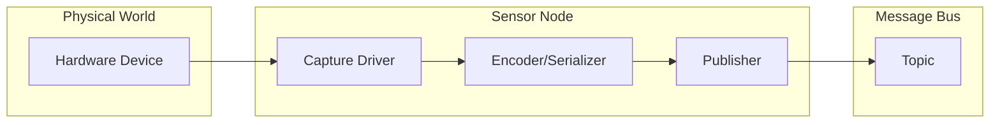

# Sensors

Sensors are components that capture data from the physical world and publish it to the Zenoh message bus.

## Available Sensors

| Sensor | Status | Description |
|--------|--------|-------------|
| [RTSP Camera](rtsp-camera.md) | Available | Stream H264 video from IP cameras |

## Planned Sensors

| Sensor | Description | Target |
|--------|-------------|--------|
| IMU | Accelerometer, gyroscope, magnetometer | TBD |
| LiDAR | 3D point cloud capture (Ouster, Velodyne) | TBD |
| GPS | NMEA GPS receiver | TBD |
| Depth Camera | RGB-D cameras (RealSense, ZED) | TBD |
| Microphone | Audio capture | TBD |

## Sensor Architecture



## Common Patterns

### Published Data

Sensors typically publish:

- Raw or compressed data
- Timestamps (acquisition and publication)
- Sequence numbers for ordering
- Frame identifiers

### Message Header

All sensor messages include a common header:

```protobuf
message Header {
    uint64 acq_time = 1;   // When data was captured
    uint64 pub_time = 2;   // When message was published
    uint32 sequence = 3;   // Sequence number
    string frame_id = 4;   // Sensor identifier
}
```

See [Header API](../../api/header.md) for details.

## Configuration

Sensors are configured via YAML files:

```yaml
# Example sensor configuration
sensor_name:
  device: "/dev/video0"      # Hardware device
  rate: 30                   # Capture rate (Hz)
  topic: "/sensor/data"      # Output topic
```

Each sensor type has its own configuration options. See the individual sensor pages for details.

## Next Steps

- [RTSP Camera](rtsp-camera.md) — IP camera streaming
- [Topics](../../concepts/topics.md) — Topic naming conventions
- [Header API](../../api/header.md) — Common header format
