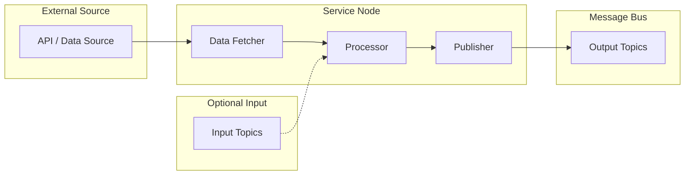

# Services

Services are components that provide data processing, external integrations, or computed outputs. Unlike sensors, services may not directly interact with hardware but instead consume data from other sources.

## Available Services

| Service | Status | Description |
|---------|--------|-------------|
| [OpenMeteo](openmeteo.md) | Available | Weather data from Open-Meteo API |

## Planned Services

| Service | Description | Target |
|---------|-------------|--------|
| ML Inference | Object detection, classification using TensorRT/ONNX | TBD |
| SLAM | Simultaneous localization and mapping | TBD |
| Path Planning | Navigation and trajectory planning | TBD |
| Speech Recognition | Voice command processing | TBD |

## Service Architecture



## Common Patterns

### Data Flow

Services typically:

1. Fetch data from external sources (APIs, databases, files)
2. Process or transform the data
3. Publish results to the message bus

### Input/Output

Services may have:

- **Publishers**: Output topics for processed data
- **Subscribers**: Input topics for configuration or triggers

## Configuration

Services are configured via YAML files:

```yaml
# Example service configuration
service_name:
  api_url: "https://api.example.com"
  refresh_interval: 60
  output_topic: "/service/data"
```

Each service type has its own configuration options. See the individual service pages for details.

## Integration Points

Services can integrate with:

| Source | Example |
|--------|---------|
| REST APIs | Weather, maps, notifications |
| Databases | Time-series data, configurations |
| ML Models | Inference engines, classifiers |
| Cloud Services | Storage, compute, messaging |

## Next Steps

- [OpenMeteo](openmeteo.md) — Weather data service
- [Topics](../../concepts/topics.md) — Topic naming conventions
- [Messaging](../../concepts/messaging.md) — Communication patterns
