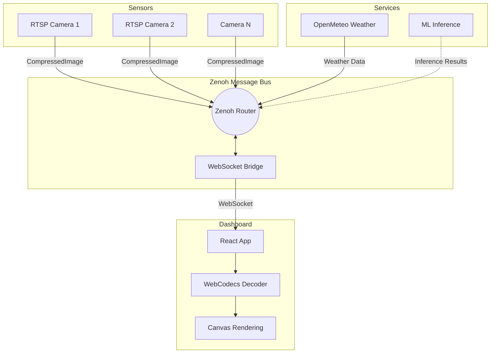
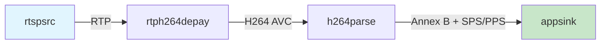
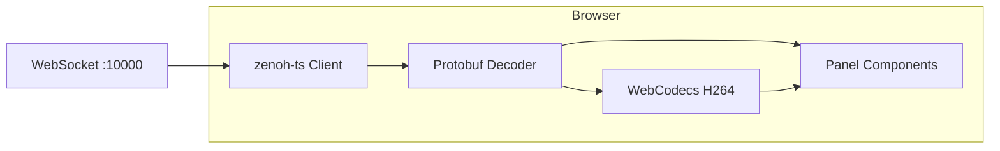

# Architecture

Bubbaloop is designed as a modular orchestration system where specialized components (Bubbles) communicate through a unified messaging layer (Loop).

## System Overview



## Data Flow

```
Component → Protobuf Message → Zenoh → WebSocket Bridge → Browser
```

1. **Component**: Captures or processes data (camera, weather service, etc.)
2. **Protobuf**: Serializes data into efficient binary format
3. **Zenoh**: Routes messages via pub/sub topics
4. **Bridge**: Translates Zenoh protocol to WebSocket
5. **Browser**: Decodes and visualizes data

## Core Components

### Sensors

Sensors capture data from the physical world and publish it to the message bus.

| Sensor | Output | Description |
|--------|--------|-------------|
| RTSP Camera | CompressedImage | H264 video frames from RTSP cameras |
| IMU (future) | IMUData | Accelerometer, gyroscope data |
| LiDAR (future) | PointCloud | 3D point cloud data |

See [Sensors](../components/sensors/index.md) for available sensors.

### Services

Services provide data processing, external integrations, or computed outputs.

| Service | Output | Description |
|---------|--------|-------------|
| OpenMeteo | Weather data | Current conditions and forecasts |
| ML Inference (future) | Detections | Object detection, classification |

See [Services](../components/services/index.md) for available services.

### Actuators

Actuators interact with the physical world based on commands.

| Actuator | Input | Description |
|----------|-------|-------------|
| Motor (future) | Velocity | Speed and direction control |
| Servo (future) | Position | Angular position control |

See [Actuators](../components/actuators/index.md) for planned actuators.

## Camera Pipeline

The camera pipeline is optimized for zero-copy H264 passthrough:



**Key optimizations:**

- No decoding on the server (zero CPU overhead)
- SPS/PPS headers injected before keyframes
- Zero-copy buffer mapping from GStreamer

### Camera Node

Each camera runs as an independent node:

- Wraps GStreamer pipeline in ROS-Z node
- Publishes `CompressedImage` messages
- Includes timestamps and sequence numbers
- Handles graceful shutdown

## Messaging Layer

### Zenoh

[Zenoh](https://zenoh.io/) provides the messaging backbone:

- **Pub/Sub**: Efficient topic-based routing
- **Low latency**: Designed for robotics and IoT
- **Flexible topology**: Peer-to-peer or routed
- **Multiple protocols**: TCP, UDP, WebSocket

### WebSocket Bridge

The `zenoh-bridge-remote-api` enables browser access:

- Translates Zenoh protocol to WebSocket
- Listens on TCP:7448 for Rust clients
- Serves WebSocket on port 10000 for browsers

See [Messaging](messaging.md) for protocol details.

## Dashboard Architecture

The React dashboard provides real-time visualization:



**Components:**

| Component | Purpose |
|-----------|---------|
| zenoh-ts | TypeScript Zenoh client for WebSocket |
| Protobuf decoder | Parses binary messages |
| WebCodecs | Hardware-accelerated H264 decoding |
| Panels | Render camera, weather, stats, etc. |

## Performance

| Metric | Value |
|--------|-------|
| CPU overhead | Near zero (no decode on server) |
| Latency | ~200ms (configurable) |
| Memory per camera | ~10-50MB |
| Max cameras | Limited by network bandwidth |

## Browser Requirements

WebCodecs API is required for H264 decoding:

| Browser | Support |
|---------|---------|
| Chrome 94+ | Supported |
| Edge 94+ | Supported |
| Safari 16.4+ | Supported |
| Firefox | Not supported |

## Next Steps

- [Messaging](messaging.md) — Zenoh/ROS-Z messaging patterns
- [Topics](topics.md) — Topic naming conventions
- [Components](../components/index.md) — Available components
