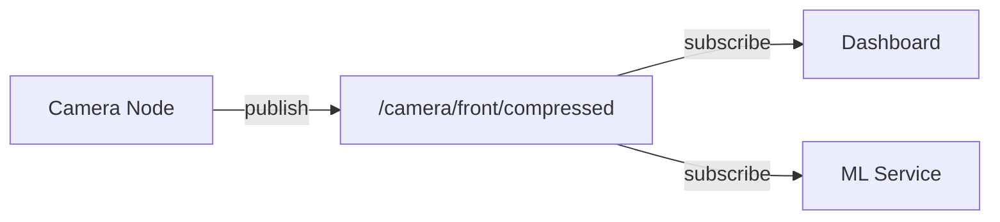
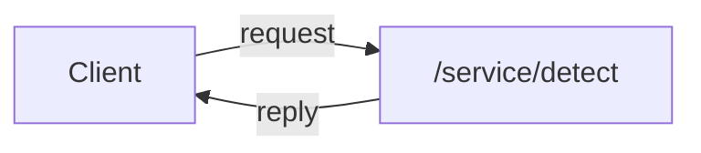

# Messaging

Bubbaloop uses Zenoh with ROS-Z conventions for all inter-component communication.

## Zenoh Overview

[Zenoh](https://zenoh.io/) is a pub/sub/query protocol designed for robotics and IoT:

- **Low latency**: Optimized for real-time systems
- **Scalable**: From embedded to cloud
- **Protocol agnostic**: TCP, UDP, WebSocket, shared memory
- **Peer-to-peer or routed**: Flexible network topology

## Message Patterns

### Publish/Subscribe

Components publish data to topics and subscribe to topics of interest:



**Example: Publishing**
```rust
// Rust publisher
let publisher = session.declare_publisher("0/camera%front%compressed").await?;
publisher.put(compressed_image_bytes).await?;
```

**Example: Subscribing**
```typescript
// TypeScript subscriber
const subscriber = session.declareSubscriber("0/camera%front%compressed/**");
subscriber.callback = (sample) => {
    const image = CompressedImage.decode(sample.payload);
    // Process image...
};
```

### Request/Reply (Future)

For RPC-style interactions (planned):



## ROS-Z Conventions

Bubbaloop uses ROS-Z conventions for topic naming and message formats.

### Topic Format

ROS topics are mapped to Zenoh key expressions:

| ROS Topic | Zenoh Key Expression |
|-----------|---------------------|
| `/camera/front/compressed` | `0/camera%front%compressed/**` |
| `/weather/current` | `0/weather%current/**` |

**Conversion rules:**

- Leading `/` removed
- `/` replaced with `%`
- Prefix `0/` added (namespace)
- Suffix `/**` for wildcard matching

### Message Serialization

Messages use Protocol Buffers (protobuf) for serialization:

```protobuf
message CompressedImage {
    Header header = 1;
    string format = 2;
    bytes data = 3;
}
```

See [API Reference](../api/index.md) for all message types.

## Network Topology

### Local Development

```
┌─────────────────────────────────────────────────┐
│                  Local Machine                   │
│  ┌────────────┐    ┌──────────────────────────┐ │
│  │  cameras   │───▶│  zenoh-bridge            │ │
│  └────────────┘    │  - TCP :7447 (router)    │ │
│  ┌────────────┐    │  - WS :10000 (browser)   │ │
│  │  weather   │───▶│                          │ │
│  └────────────┘    └────────────┬─────────────┘ │
│                                 │               │
│                    ┌────────────▼─────────────┐ │
│                    │  Dashboard (browser)      │ │
│                    │  http://localhost:5173    │ │
│                    └──────────────────────────┘ │
└─────────────────────────────────────────────────┘
```

### Distributed Setup

```
┌─────────────────────────────────────────────────┐
│                Server (Robot)                    │
│  ┌────────────┐         ┌────────────────────┐  │
│  │  cameras   │──TCP───▶│  zenohd            │  │
│  │  (-z :7447)│  :7447  │  - tcp :7447       │  │
│  └────────────┘         │  - ws :10000       │  │
│  ┌────────────┐         └─────────┬──────────┘  │
│  │  weather   │──TCP─────────────▶│            │
│  └────────────┘                   │            │
└───────────────────────────────────┼─────────────┘
                                    │ TCP :7447
┌───────────────────────────────────┼─────────────┐
│               Client (Laptop)     │             │
│                     ┌─────────────▼──────────┐  │
│  ┌──────────┐  WS   │  zenohd               │  │
│  │ Dashboard│◀──────│  - connects to server │  │
│  └──────────┘:10000 │  - ws :10000 (local)  │  │
│                     └────────────────────────┘  │
└─────────────────────────────────────────────────┘
```

## Quality of Service

Zenoh supports various QoS settings:

| Setting | Description |
|---------|-------------|
| Reliability | Best-effort or reliable delivery |
| Congestion | Drop or block on congestion |
| Priority | Message priority (1-7) |
| Express | Bypass batching for low latency |

For camera streams, best-effort delivery is typically used to minimize latency.

## WebSocket Bridge

The `zenoh-bridge-remote-api` provides browser access:

**Ports:**

| Port | Protocol | Purpose |
|------|----------|---------|
| 7447 | TCP | Zenoh router (internal) |
| 10000 | WebSocket | Browser clients |

**Configuration:**

```json5
{
  mode: "router",
  listen: {
    endpoints: ["tcp/0.0.0.0:7447"],
  },
  plugins: {
    remote_api: {
      websocket_port: 10000,
    },
  },
}
```

## TypeScript Client

The dashboard uses `zenoh-ts` for WebSocket subscriptions:

```typescript
import { Session } from "@aspect-build/aspect-ts";

const session = await Session.open({
    mode: "client",
    connect: { endpoints: ["ws://localhost:10000"] }
});

// Subscribe to camera topic
const subscriber = session.declareSubscriber("0/camera%front%compressed/**");
```

## Next Steps

- [Topics](topics.md) — Topic naming conventions
- [API Reference](../api/index.md) — Message type definitions
- [Architecture](architecture.md) — System overview
