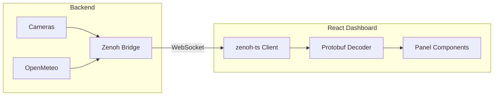

# Dashboard

The Bubbaloop Dashboard is a React-based web application for real-time monitoring and visualization of data from all components in the system.

## Overview



## Features

| Feature | Description |
|---------|-------------|
| Real-time streaming | Live video and data updates |
| Multi-panel layout | View multiple data sources simultaneously |
| Drag-and-drop | Reorder panels to customize layout |
| Topic discovery | Auto-discover available topics |
| WebCodecs decoding | Hardware-accelerated H264 decoding |
| HTTPS support | Secure remote access |
| Responsive design | Works on desktop and mobile |

## Quick Start

```bash
# Start all services including dashboard
pixi run up
```

**Local access:** http://localhost:5173
**Remote access:** https://\<your-ip\>:5173 (accept self-signed cert)

## Panel Types

The dashboard supports multiple panel types for different data:

| Panel | Description |
|-------|-------------|
| [Camera](panels/camera.md) | H264 video stream with live stats |
| [Raw Data](panels/raw-data.md) | JSON view of any topic data |
| [Weather](panels/weather.md) | OpenMeteo weather conditions and forecasts |
| [Stats](panels/stats.md) | Topic frequency and message metrics |

## Interface

### Header

The header displays:

- **Bubbaloop** — Application name
- **Connection status** — Green (connected), Yellow (connecting), Red (error)
- **Refresh button** — Reconnect if disconnected

### Main Area

The main area contains:

- **Panels** — Grid of data visualization panels
- **Add Panel** button — Add new panels to the dashboard

### Panel Controls

Each panel has controls:

| Control | Description |
|---------|-------------|
| Edit | Configure panel settings |
| Info | View metadata and statistics |
| Maximize | Expand panel to full view |
| Remove | Delete panel from dashboard |
| Drag handle | Reorder panels |

## Connection

### Auto-Connect

The dashboard automatically connects to the Zenoh WebSocket bridge via the built-in Vite proxy:

1. Dashboard loads at `:5173`
2. WebSocket proxied to bridge at `:10000`
3. Connection established automatically

### Connection Status

| Status | Indicator | Action |
|--------|-----------|--------|
| Connected | Green dot | Ready to stream |
| Connecting | Yellow pulsing | Wait for connection |
| Error | Red dot | Click refresh to retry |

### Manual Reconnect

If connection fails:

1. Check that `pixi run bridge` is running
2. Click the refresh button in the header
3. Check browser console for errors

## Adding Panels

### From Topic Discovery

1. Click **Add Camera** or **Add Panel**
2. Click the edit icon
3. Select from discovered topics
4. Click **Save**

### Manual Topic Entry

1. Click **Add Camera** or **Add Panel**
2. Click the edit icon
3. Enter topic pattern: `0/camera%name%compressed/**`
4. Click **Save**

## Browser Requirements

| Browser | Version | Status |
|---------|---------|--------|
| Chrome | 94+ | Recommended |
| Edge | 94+ | Supported |
| Safari | 16.4+ | Supported |
| Firefox | — | Not supported |

!!! warning "WebCodecs Required"
    The Camera panel requires the WebCodecs API for H264 decoding. Firefox does not support WebCodecs.

## Running Individually

To run the dashboard separately:

```bash
# Terminal 1: Zenoh bridge
pixi run bridge

# Terminal 2: Services (cameras, weather)
pixi run cameras
pixi run weather

# Terminal 3: Dashboard
pixi run dashboard
```

## Development

The dashboard is located in the `dashboard/` directory:

```
dashboard/
├── src/
│   ├── components/     # React components
│   ├── hooks/          # Custom hooks
│   ├── lib/            # Utilities
│   └── proto/          # Generated protobuf
├── package.json
└── vite.config.ts
```

### Local Development

```bash
cd dashboard
npm install
npm run dev
```

### Building

```bash
cd dashboard
npm run build
```

## Next Steps

- [Camera Panel](panels/camera.md) — Video stream configuration
- [Raw Data Panel](panels/raw-data.md) — JSON data viewing
- [Weather Panel](panels/weather.md) — Weather display
- [Stats Panel](panels/stats.md) — Metrics and statistics
- [Remote Access](remote-access.md) — HTTPS and network setup
