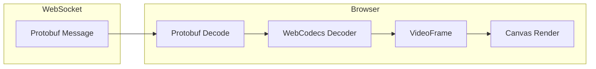

# Camera Panel

The Camera panel displays live H264 video streams from RTSP cameras using hardware-accelerated WebCodecs decoding.

## Overview

| Property | Value |
|----------|-------|
| Input | `CompressedImage` (H264) |
| Topic Pattern | `0/camera%{name}%compressed/**` |
| Decoder | WebCodecs VideoDecoder |
| Display | Canvas element |

## Features

- **Hardware-accelerated decoding** via WebCodecs API
- **Live statistics** — FPS, frame count, resolution
- **Metadata panel** — Timestamps, latency, sequence numbers
- **Maximize view** — Full-screen camera display
- **Auto keyframe sync** — Waits for keyframe before decoding

## Adding a Camera Panel

### From Topic Discovery

1. Click **Add Camera**
2. Click the edit icon on the new panel
3. Select a camera topic from the dropdown
4. Click **Save**

### Manual Entry

1. Click **Add Camera**
2. Click the edit icon
3. Enter the topic pattern: `0/camera%front_door%compressed/**`
4. Click **Save**

## Panel Interface

### Video Display

The main area shows the decoded video stream on a canvas element.

### Status Bar

The status bar shows:

| Stat | Description |
|------|-------------|
| **FPS** | Current frames per second (smoothed) |
| **frames** | Total frames received |
| **res** | Video resolution (e.g., 1920×1080) |
| **Status** | LIVE (decoding) or INIT (waiting) |

### Controls

| Control | Icon | Description |
|---------|------|-------------|
| Edit | Pencil | Configure topic |
| Info | Circle-i | Show/hide metadata |
| Maximize | Expand | Full-screen view |
| Remove | X | Delete panel |

## Metadata Panel

Click the info icon to show detailed metadata:

| Field | Description |
|-------|-------------|
| **Format** | Video codec (h264) |
| **Data Size** | Frame size in bytes |
| **Sequence** | Frame sequence number |
| **Frame ID** | Camera identifier |
| **Acq Time** | Acquisition timestamp (ns) |
| **Pub Time** | Publication timestamp (ns) |
| **Latency** | Acquisition to publication delay |

## Decoding Pipeline



### Keyframe Handling

H264 decoding requires an initial keyframe (I-frame):

1. Panel displays "Waiting for keyframe..."
2. First keyframe arrives with SPS/PPS headers
3. Decoder initializes with codec configuration
4. Subsequent frames (P-frames, B-frames) decoded

### WebCodecs Configuration

The decoder is configured based on the H264 stream:

```typescript
const config: VideoDecoderConfig = {
    codec: "avc1.640028",  // H264 High Profile
    codedWidth: 1920,
    codedHeight: 1080,
    hardwareAcceleration: "prefer-hardware"
};
```

## Performance

### Expected FPS

| Source | Typical FPS |
|--------|-------------|
| RTSP main stream | 25-30 fps |
| RTSP sub stream | 15-25 fps |
| WiFi camera | 10-20 fps |

### Latency

End-to-end latency (camera to display):

| Component | Typical Latency |
|-----------|-----------------|
| Camera encoding | 30-100ms |
| Network + GStreamer | 100-300ms |
| WebSocket + Decode | 20-50ms |
| **Total** | 150-450ms |

### Resource Usage

| Resource | Usage |
|----------|-------|
| CPU | Low (hardware decode) |
| GPU | Moderate (decode + render) |
| Memory | ~50-100MB per camera |

## Troubleshooting

### "Waiting for keyframe"

- Wait a few seconds for the next keyframe
- Check that camera is streaming (see `pixi run cameras` logs)
- Verify H264 format (not H265/HEVC)

### Low FPS

- Check network bandwidth
- Use sub-stream instead of main stream
- Reduce number of simultaneous cameras

### Decoder error

- Refresh the browser
- Check browser console for codec errors
- Verify stream is valid H264

### Black screen

- Verify camera is connected
- Check topic is correct
- Look for errors in browser console

### High latency

- Reduce `latency` in camera config
- Use wired network connection
- Check for network congestion

## Browser Support

| Browser | WebCodecs | H264 HW Decode |
|---------|-----------|----------------|
| Chrome 94+ | Yes | Yes |
| Edge 94+ | Yes | Yes |
| Safari 16.4+ | Yes | Yes |
| Firefox | No | No |

## Configuration

### Topic Pattern

Camera topics use the format:

```
0/camera%{name}%compressed/**
```

**Examples:**

| Camera Name | Topic Pattern |
|-------------|---------------|
| `front_door` | `0/camera%front_door%compressed/**` |
| `backyard` | `0/camera%backyard%compressed/**` |
| `entrance` | `0/camera%entrance%compressed/**` |

### Wildcard Subscription

To subscribe to all cameras:

```
0/camera%**
```

## Next Steps

- [RTSP Camera](../../components/sensors/rtsp-camera.md) — Camera configuration
- [Camera API](../../api/camera.md) — Message format
- [Dashboard Overview](../index.md) — Other panel types
