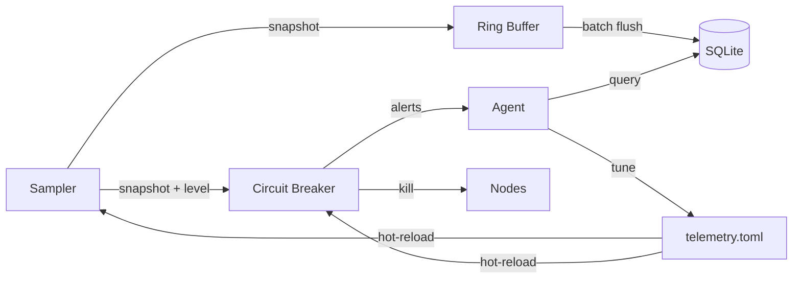
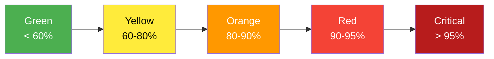
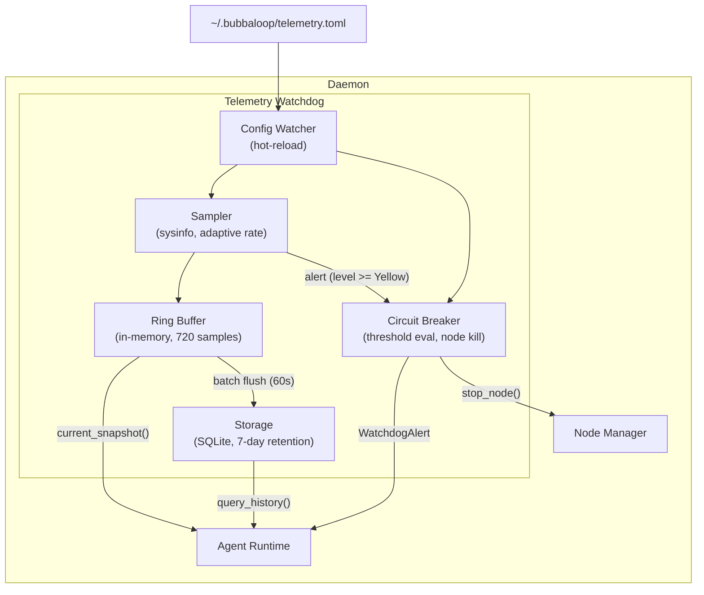

# Telemetry Watchdog

The telemetry watchdog monitors memory, CPU, and disk — and prevents out-of-memory crashes on edge devices like Jetson, Raspberry Pi, or any long-running bubbaloop deployment.

!!! tip "Zero config required"
    The watchdog starts automatically with the daemon. No configuration needed unless you want to tune thresholds.

---

## How It Works

Three components with clear separation of concerns:



| Component | What it does | Latency |
|-----------|-------------|---------|
| **Sampler** | Reads memory/CPU/disk via `sysinfo`, adapts polling rate to pressure | Background |
| **Circuit Breaker** | Kills nodes at critical thresholds — no LLM needed | ~100ms |
| **Agent Bridge** | Gives the AI agent tools + alerts for smart decisions | Seconds |

!!! important "The circuit breaker never waits for the agent"
    At Red/Critical levels, nodes are killed immediately. The agent is *notified after the fact* and decides whether to restart them.

---

## Threshold Levels

The watchdog classifies system state into five levels based on memory usage:



| Level | Memory Used | Sampling | What Happens |
|-------|------------|----------|--------------|
| **Green** | < 60% | Every 30s | Normal operation |
| **Yellow** | 60-80% | Every 10s | Agent receives warning |
| **Orange** | 80-90% | Every 5s | Agent receives urgent alert with top consumers |
| **Red** | 90-95% | Every 5s | Circuit breaker kills largest non-essential node |
| **Critical** | > 95% | Every 5s | Circuit breaker kills ALL non-essential nodes |

??? info "Additional thresholds (CPU and disk)"
    - **CPU > 95% for 60s sustained**: Warning sent to agent (no auto-kill — high CPU is often legitimate)
    - **Disk < 1GB free**: Warning sent to agent
    - **Disk < 200MB free**: Critical disk alert

---

## Configuration

All configuration lives in `~/.bubbaloop/telemetry.toml`. Every field is optional — sensible defaults apply.

=== "Minimal (recommended)"

    ```toml
    # Nothing needed! Defaults work for most deployments.
    # Create this file only to override specific values.
    ```

=== "Full reference"

    ```toml
    [telemetry]
    enabled = true
    monitored_disk_path = "/"

    [telemetry.sampling]
    idle_secs = 30           # Green level polling interval
    elevated_secs = 10       # Yellow level polling interval
    critical_secs = 5        # Orange/Red/Critical polling interval
    ring_capacity = 720      # In-memory samples (1hr at 5s)

    [telemetry.thresholds]
    yellow_pct = 60          # Memory % to trigger Yellow
    orange_pct = 80          # Memory % to trigger Orange
    red_pct = 90             # Memory % to trigger Red (auto-kill)
    critical_pct = 95        # Memory % to trigger Critical (kill all)
    cpu_warn_pct = 95        # CPU % for sustained warning
    cpu_sustained_secs = 60  # Seconds CPU must stay above threshold
    disk_warn_mb = 1024      # Disk free MB for warning
    disk_critical_mb = 200   # Disk free MB for critical

    [telemetry.circuit_breaker]
    enabled = true
    cooldown_secs = 30       # Min seconds between node kills

    [telemetry.storage]
    flush_interval_secs = 60 # How often to flush ring buffer to SQLite
    retention_days = 7       # How long to keep history
    ```

### Hot-Reload

Changes to `telemetry.toml` are picked up automatically — no daemon restart needed. The file is watched and reloaded within 200ms of saving.

### Guardrails

The agent (or manual edits) cannot set unsafe values:

| Parameter | Minimum | Maximum | Why |
|-----------|---------|---------|-----|
| `critical_pct` | 80 | 98 | Prevent disabling safety or triggering too early |
| All sampling intervals | 2s | No limit | Prevent CPU-burning poll loops |

Values outside these ranges are automatically clamped and logged.

---

## Agent Tools

The AI agent has three telemetry tools available via MCP dispatch.

### `get_system_telemetry`

Returns current system state — memory, CPU, disk, top processes.

??? example "Example response"
    ```json
    {
      "memory_used_percent": 62.3,
      "memory_available_mb": 3042,
      "cpu_usage_percent": 34.1,
      "disk_free_gb": 12.8,
      "watchdog_level": "Yellow",
      "top_processes": [
        {"name": "yolo-inference", "pid": 1234, "rss_mb": 890, "cpu_percent": 45.1},
        {"name": "rtsp-camera", "pid": 5678, "rss_mb": 412, "cpu_percent": 18.2}
      ]
    }
    ```

### `get_telemetry_history`

Returns historical data with trend analysis. Useful for detecting memory leaks.

??? example "Example response"
    ```json
    {
      "duration_minutes": 60,
      "sample_count": 60,
      "samples": [
        {"timestamp_ms": 1709654400000, "memory_used_percent": 58.2, "cpu_percent": 30.1, "disk_free_gb": 13.1}
      ],
      "memory_trend_per_hour": 2.1,
      "trend_description": "memory_rising"
    }
    ```

!!! warning "Trend descriptions"
    | Trend | Meaning |
    |-------|---------|
    | `memory_rising_fast` | > 2%/hour — investigate immediately |
    | `memory_rising` | 0.5-2%/hour — potential leak |
    | `stable` | Normal |
    | `memory_falling` | Resources being freed |

### `update_telemetry_config`

The agent can tune thresholds at runtime. Only provided fields are updated. Guardrails enforced automatically.

```json
{
  "red_pct": 85,
  "cooldown_secs": 60,
  "idle_secs": 15
}
```

---

## System Prompt Injection

Every agent turn includes a one-line resource summary — no tool call needed:

```
## System Resources
Memory: 62% used (Yellow) | CPU: 34% | Disk: 12.8GB free
```

This gives the agent passive awareness of system health at zero cost.

---

## Alert Events

The agent receives these alerts automatically via the broadcast channel (no polling):

| Alert | When | Suggested Action |
|-------|------|-----------------|
| `ResourceWarning` | Yellow/Orange threshold crossed | Investigate top consumers |
| `NodeKilledByWatchdog` | Circuit breaker fired | Decide whether to restart |
| `ResourceRecovered` | Level dropped back to Green | Consider restarting killed nodes |
| `TrendAlert` | Sustained CPU high | Investigate workload |

---

## Architecture



### Data Storage

| Storage | Location | Purpose | Retention |
|---------|----------|---------|-----------|
| Ring Buffer | RAM | Fast circuit breaker reads | ~720 samples (rolling) |
| SQLite | `~/.bubbaloop/telemetry.db` | Agent history queries, post-mortems | 7 days (configurable) |

The telemetry database is separate from the agent memory database to prevent write contention.

---

## Cross-Platform Support

The watchdog uses the `sysinfo` crate — no `/proc` assumptions:

| Platform | Memory | CPU | Disk | Processes |
|----------|--------|-----|------|-----------|
| Linux (ARM64 / Jetson) | Yes | Yes | Yes | Yes |
| Linux (x86_64) | Yes | Yes | Yes | Yes |
| macOS | Yes | Yes | Yes | Yes |

---

## Troubleshooting

??? question "Watchdog killed my node"
    Check the daemon logs for `[WATCHDOG]` entries:

    ```bash
    journalctl -u bubbaloop --since "1 hour ago" | grep WATCHDOG
    ```

    The log shows which node was killed and why:

    ```
    [WATCHDOG] RED: Stopping node 'yolo-inference' (RSS 890MB, memory available 8.2%)
    ```

??? question "Node keeps getting killed"
    The agent decides whether to restart killed nodes. If a node has a memory leak, it will be killed repeatedly. Options:

    1. **Fix the leak** in the node
    2. **Relax the threshold** temporarily — edit `~/.bubbaloop/telemetry.toml` and increase `red_pct`
    3. **Mark as essential** (future) — add `essential: true` to the node's `node.yaml` manifest

??? question "How do I disable the watchdog?"
    Disable entirely:

    ```toml
    # ~/.bubbaloop/telemetry.toml
    [telemetry]
    enabled = false
    ```

    Or disable only the circuit breaker (keep monitoring):

    ```toml
    [telemetry.circuit_breaker]
    enabled = false
    ```

---

## Source Code

| Module | File | Lines |
|--------|------|-------|
| Types & config | `crates/bubbaloop/src/daemon/telemetry/types.rs` | ~250 |
| Sampler | `crates/bubbaloop/src/daemon/telemetry/sampler.rs` | ~150 |
| Circuit breaker | `crates/bubbaloop/src/daemon/telemetry/circuit_breaker.rs` | ~200 |
| SQLite storage | `crates/bubbaloop/src/daemon/telemetry/storage.rs` | ~150 |
| Service & config watcher | `crates/bubbaloop/src/daemon/telemetry/mod.rs` | ~250 |
| Agent dispatch (3 tools) | `crates/bubbaloop/src/agent/dispatch.rs` | integrated |

**Source:** `crates/bubbaloop/src/daemon/telemetry/`
