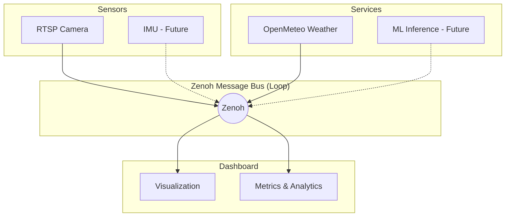

# Bubbaloop

**Orchestration system for Physical AI** — Build intelligent robotic systems by composing sensors, actuators, and services through a unified messaging layer.

## What is Bubbaloop?

Bubbaloop is an orchestration framework for building physical AI systems. The name combines **Bubbles** (nodes/components) interconnected through a messaging **Loop**, creating a flexible architecture where specialized components can be composed into complete robotic solutions.

### Core Concepts

- **Sensors** capture data from the physical world (cameras, IMUs, LiDAR)
- **Services** provide data processing and external integrations (weather, ML inference)
- **Actuators** interact with the physical world (motors, servos, speakers)
- **Dashboard** provides real-time monitoring, visualization, and analytics

All components communicate via [Zenoh](https://zenoh.io/)/ROS-Z messaging for low-latency, distributed operation.

## Component Architecture



## Features

| Feature | Description |
|---------|-------------|
| Zero-copy H264 passthrough | Direct stream forwarding, no decoding overhead |
| Multi-camera support | Stream from multiple RTSP cameras simultaneously |
| Zenoh/ROS-Z integration | Publish/subscribe with ROS-compatible topics |
| React Dashboard | Real-time browser visualization with WebCodecs |
| Weather integration | OpenMeteo weather data as a service |
| Remote access | HTTPS with self-signed cert, single-port deployment |
| Simple YAML config | Easy component configuration |

## Tech Stack

| Component | Technology |
|-----------|------------|
| Language | Rust |
| Video Capture | GStreamer |
| Messaging | Zenoh / ROS-Z |
| Dashboard | React + WebCodecs |
| Package Manager | Pixi |

## Quick Start

### Install

```bash
curl -sSL https://github.com/kornia/bubbaloop/releases/latest/download/install.sh | bash
```

### Run

```bash
# Start Zenoh router
zenohd &

# Start the TUI
bubbaloop
```

### Development

For building from source:

```bash
git clone https://github.com/kornia/bubbaloop.git
cd bubbaloop
pixi install
pixi run up
```

Open http://localhost:5173 in Chrome, Edge, or Safari.

See [Quickstart](getting-started/quickstart.md) for detailed setup instructions.

## Available Commands

| Command | Description |
|---------|-------------|
| `pixi run up` | Start all services (recommended) |
| `pixi run cameras` | Start camera capture and Zenoh publishing |
| `pixi run weather` | Start weather data service |
| `pixi run dashboard` | Start React dashboard |
| `pixi run build` | Build Rust binaries |
| `pixi run docs` | Serve documentation locally |

## Community

- [Discord Server](https://discord.com/invite/HfnywwpBnD)
- [GitHub Repository](https://github.com/kornia/bubbaloop)
