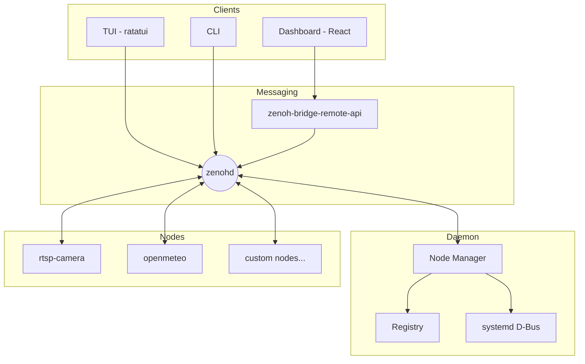

# Bubbaloop

**AI-native orchestration for Physical AI** — Build intelligent robotic systems by composing sensors, actuators, and services through a unified messaging layer.

## What is Bubbaloop?

Bubbaloop is an orchestration framework for building physical AI systems. The name combines **Bubbles** (nodes/components) interconnected through a messaging **Loop**, creating a flexible architecture where specialized components can be composed into complete robotic solutions.

### Core Concepts

- **Sensors** capture data from the physical world (cameras, IMUs, LiDAR)
- **Services** provide data processing and external integrations (weather, ML inference)
- **Actuators** interact with the physical world (motors, servos, speakers)
- **Dashboard** provides real-time monitoring, visualization, and analytics

All components communicate via [Zenoh](https://zenoh.io/) messaging for low-latency, distributed operation.

## Quick Install

```bash
# One-line install (Linux x86_64/ARM64)
curl -sSL https://github.com/kornia/bubbaloop/releases/latest/download/install.sh | bash
source ~/.bashrc

# Verify installation
bubbaloop doctor --fix
bubbaloop status
```

This installs:
- **zenohd** — Pub/sub router on port 7447
- **zenoh-bridge-remote-api** — WebSocket bridge on port 10001
- **bubbaloop** — Single 7MB binary (CLI + TUI + daemon)
- **Dashboard** — Web UI at http://localhost:8080

All run as systemd user services with autostart enabled.

## Architecture



## Features

| Feature | Description |
|---------|-------------|
| Zero-copy H264 passthrough | Direct stream forwarding, no decoding overhead |
| Multi-camera support | Stream from multiple RTSP cameras simultaneously |
| Zenoh integration | Publish/subscribe with scoped topics |
| React Dashboard | Real-time browser visualization with WebCodecs |
| Multi-instance nodes | Run same node with different configs |
| System diagnostics | `bubbaloop doctor --fix` for auto-repair |
| Fleet management | Multi-machine orchestration |

## Basic Usage

```bash
# Launch interactive TUI
bubbaloop

# Non-interactive status (for scripts/agents)
bubbaloop status

# System diagnostics with auto-fix
bubbaloop doctor --fix

# Node lifecycle
bubbaloop node add user/my-node --build --install
bubbaloop node start my-node
bubbaloop node logs my-node -f
```

## Development Setup

For building from source:

```bash
git clone https://github.com/kornia/bubbaloop.git
cd bubbaloop
pixi install
pixi run up    # Start all services
```

Dashboard: http://localhost:5173

## Available Commands

| Command | Description |
|---------|-------------|
| `bubbaloop status` | Show system and node status |
| `bubbaloop doctor` | Run diagnostics (--fix for auto-repair) |
| `bubbaloop node list` | List all nodes |
| `bubbaloop node add` | Add node from path or GitHub |
| `bubbaloop node instance` | Create multi-instance node |
| `bubbaloop marketplace list` | List node sources |

See [CLI Reference](reference/cli.md) for complete command documentation.

## Documentation

- [Quickstart](getting-started/quickstart.md) — Detailed setup instructions
- [Configuration](getting-started/configuration.md) — Config file reference
- [CLI Reference](reference/cli.md) — Command documentation
- [Troubleshooting](reference/troubleshooting.md) — Common issues and solutions
- [Architecture](concepts/architecture.md) — System design
- [Create Your First Node](guides/create-your-first-node.md) — Node development guide

## Community

- [Discord Server](https://discord.com/invite/HfnywwpBnD)
- [GitHub Repository](https://github.com/kornia/bubbaloop)
