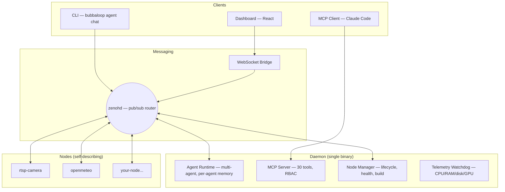

<div class="hero" markdown>

# Bubbaloop

<p class="hero-tagline">"Shrimp-fried cameras, shrimp-grilled sensors, shrimp-sauteed robots..."</p>

**The open-source Hardware AI agent.** One binary. 37 tools. Talk to your cameras, sensors, and robots in plain English.

```bash
bubbaloop up
bubbaloop agent chat "What sensors do I have?"
```

</div>

## What You Get


```mermaid
flowchart TB
    subgraph Clients
        cli["CLI — bubbaloop agent chat"]
        mcp_client["MCP Client — Claude Code"]
        dash["Dashboard — React"]
    end

    subgraph "Daemon (single binary)"
        runtime["Agent Runtime — multi-agent, per-agent memory"]
        mcp["MCP Server — 30 tools, RBAC"]
        nm["Node Manager — lifecycle, health, build"]
        watchdog["Telemetry Watchdog — CPU/RAM/disk/GPU"]
    end

    subgraph Messaging
        zenohd(("zenohd — pub/sub router"))
        bridge["WebSocket Bridge"]
    end

    subgraph "Nodes (self-describing)"
        cam["rtsp-camera"]
        weather["openmeteo"]
        custom["your-node..."]
    end

    cli --> zenohd
    mcp_client --> mcp
    dash --> bridge --> zenohd
    zenohd <--> runtime
    zenohd <--> nm
    zenohd <--> cam
    zenohd <--> weather
    zenohd <--> custom
```

A single ~12 MB Rust binary runs as a systemd service. The daemon hosts:

- **Agent Runtime**: Multi-agent Zenoh gateway with per-agent Soul, 3-tier memory, adaptive heartbeat
- **MCP Server**: 37 tools across 7 categories — node lifecycle, fleet discovery, agent memory, telemetry, scheduling
- **Node Manager**: Build, install, start/stop nodes as systemd services
- **Telemetry Watchdog**: CPU, RAM, disk, GPU monitoring with circuit breakers

## 5 Minutes to Magic

```bash
# 1. Install
curl -sSL https://github.com/kornia/bubbaloop/releases/latest/download/install.sh | bash
source ~/.bashrc

# 2. Login
bubbaloop login

# 3. Start everything
bubbaloop up

# 4. Talk to your hardware
bubbaloop agent chat
```

First time? The agent introduces itself and asks what you care about. It remembers.

## Features

<div class="feature-grid" markdown>
<div class="card" markdown>

### Agent Runtime
<span class="badge badge-agent">Agent</span>

Multi-agent with Zenoh gateway. Each agent gets its own Soul and memory.

</div>
<div class="card" markdown>

### 37 Tools
<span class="badge badge-mcp">MCP</span>

Node lifecycle, fleet discovery, memory search, telemetry, scheduling, proposals.

</div>
<div class="card" markdown>

### 3-Tier Memory
<span class="badge badge-agent">Agent</span>

RAM (current turn) + NDJSON logs (episodic) + SQLite (jobs, proposals, search).

</div>
<div class="card" markdown>

### Soul System
<span class="badge badge-agent">Agent</span>

`identity.md` for personality, `capabilities.toml` for model tuning. Hot-reload.

</div>
<div class="card" markdown>

### Node SDK
<span class="badge badge-node">Node</span>

Batteries-included Rust framework. ~50 lines to a working sensor node.

</div>
<div class="card" markdown>

### Self-Describing Nodes
<span class="badge badge-node">Node</span>

Schema, manifest, health, config, command — every node is discoverable.

</div>
<div class="card" markdown>

### Telemetry Watchdog
<span class="badge badge-new">New</span>

CPU/RAM/disk/GPU with 5 severity levels. Circuit breakers. Runtime-tunable.

</div>
<div class="card" markdown>

### Dashboard
<span class="badge badge-node">Node</span>

React + WebCodecs. Live camera feeds, telemetry charts, protobuf decode.

</div>
<div class="card" markdown>

### Fleet Management
<span class="badge badge-mcp">MCP</span>

Multi-machine orchestration via scoped Zenoh topics.

</div>
<div class="card" markdown>

### MCP Server
<span class="badge badge-mcp">MCP</span>

Stdio + HTTP. 3-tier RBAC (Viewer/Operator/Admin). Bearer token auth.

</div>
<div class="card" markdown>

### Adaptive Heartbeat
<span class="badge badge-agent">Agent</span>

Arousal-based decay. Active = frequent check-ins. Idle = quiet.

</div>
<div class="card" markdown>

### Dual Auth
<span class="badge badge-mcp">MCP</span>

API key or Claude subscription (OAuth). `bubbaloop login` handles both.

</div>
</div>

## Available Commands

| Command | Description |
|---------|-------------|
| `bubbaloop up` | Start daemon (agent runtime + MCP + node manager) |
| `bubbaloop agent chat` | Chat with AI agents via Zenoh |
| `bubbaloop agent list` | List running agents and capabilities |
| `bubbaloop login` | Authenticate (API key or Claude subscription) |
| `bubbaloop status` | System and node status |
| `bubbaloop doctor --fix` | Diagnostics with auto-repair |
| `bubbaloop node list` | List registered nodes |
| `bubbaloop node add` | Add node from path, GitHub, or marketplace |
| `bubbaloop mcp --stdio` | Run MCP server over stdio |

## Development Setup

```bash
git clone https://github.com/kornia/bubbaloop.git
cd bubbaloop
pixi install
pixi run up    # Start all services
```

Dashboard dev server: http://localhost:5173

## Documentation

- **[Quickstart](getting-started/quickstart.md)** — Install, login, first agent chat
- **[Architecture](concepts/architecture.md)** — Layers, agent runtime, node contract
- **[Messaging](concepts/messaging.md)** — Zenoh topics, agent gateway protocol
- **[Memory](concepts/memory.md)** — 3-tier memory architecture
- **[Configuration](getting-started/configuration.md)** — agents.toml, Soul files, telemetry.toml
- **[Agent Guide](agent-guide.md)** — Multi-agent setup, MCP tools, security model
- **[CLI Reference](reference/cli.md)** — Full command documentation
- **[Troubleshooting](troubleshooting.md)** — Common issues and fixes

## Community

[Discord](https://discord.com/invite/HfnywwpBnD) · [GitHub](https://github.com/kornia/bubbaloop)
